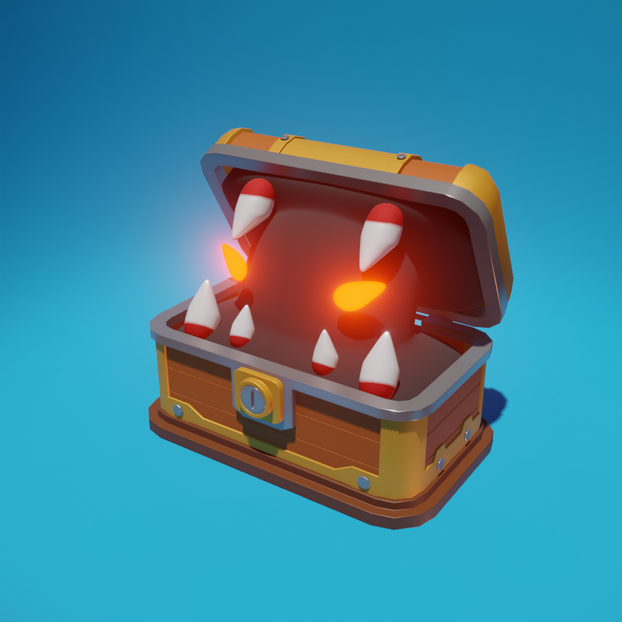

# 🧰 Mimic Chest Animation (Blender Practice Project)

This is my first completed Blender project—a 4-second animation of a treasure chest that reveals itself to be a Mimic in disguise. When opened, the chest transforms into a snarling creature, baring its fangs in hostility.

## 🎞️ Preview

> 📽️ [Watch the animation](../project-01-mimic-chest/Render/render.mp4) – 4 seconds

## 💡 Why I Made This

This Mimic may not be perfect, but I’m proud of finishing it. More importantly, it marks the start of my 3D journey. My long-term dream? Creating an open-world game or an animated short film someday. 😄

## ⚙️ What I Learned

- Basic modeling operations: `extrude`, `inset`, `loop cut`.
- Modifier operations: `bevel`, `solidify`, `mirror` and etc.
- Shader and material settings: tweaking `roughness`, `metallic`, `specular`.
- Render settings: understanding `Filmic` vs. `Standard` lighting.
- Familiarise with Blender UI navigation, animation keyframing and etc..

## 🛠️ Future Plans

- Continue the Blender course to refine skills.
- Explore rigging and more complex animations.
- Possibly integrate 3D models into Unity, Unreal or Godot for game prototypes.